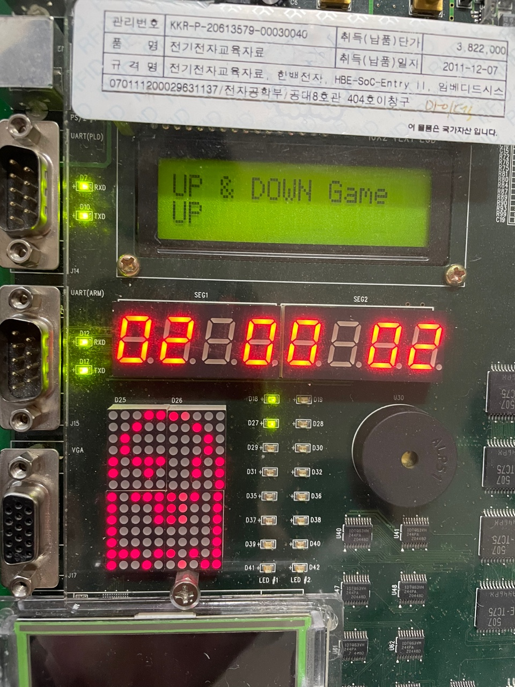
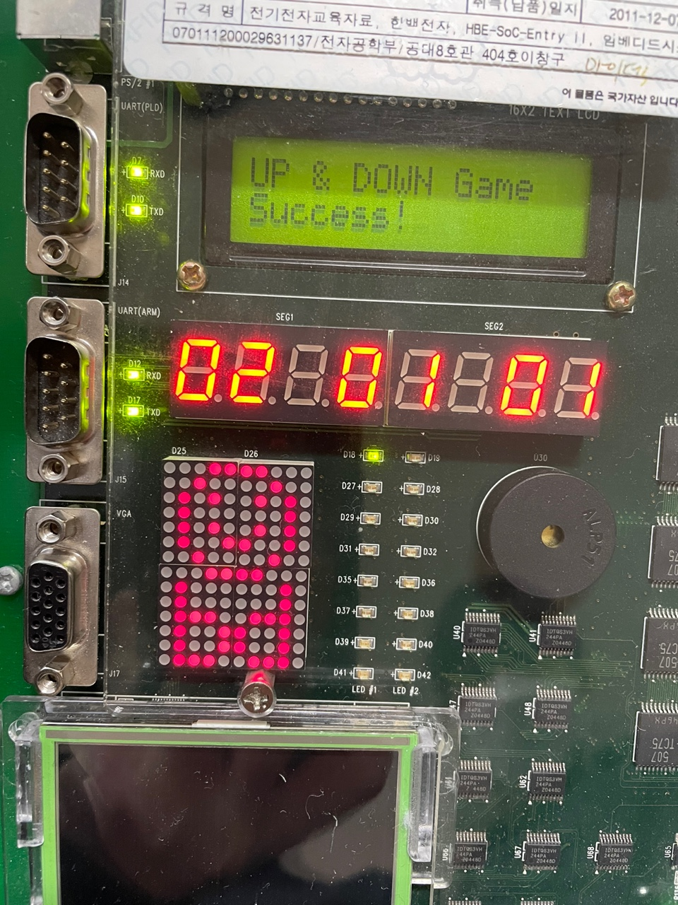
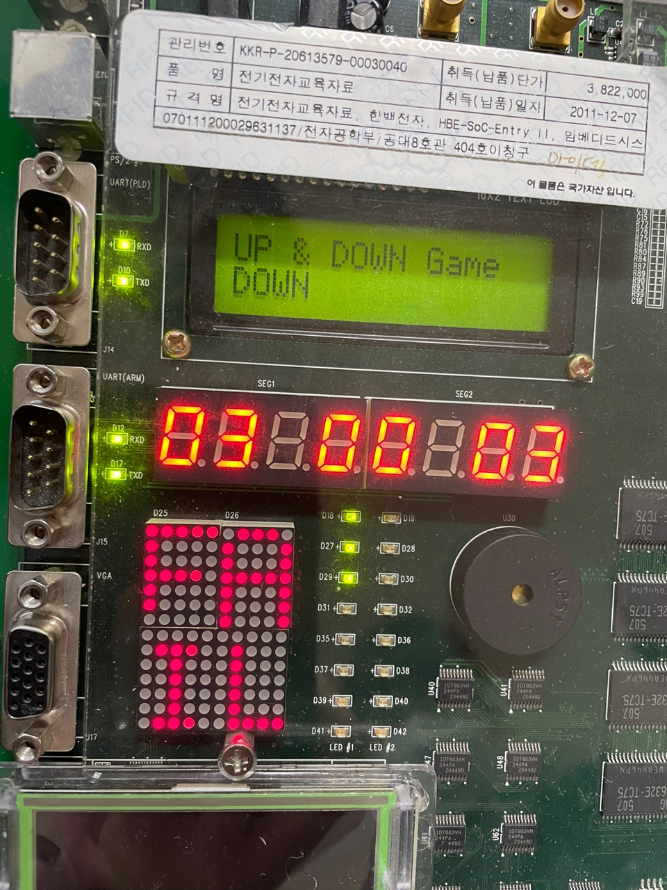

# Final project of Digital System Design class

### This page is about my final project of Digital System Design class. I took a class about adder and multiplier for 2 months and learned Verilog for 2-3 weeks in this class. After learned Verilog, I teamed up with my friends and made **"Up & Down game"** to practice Verilog and Hardware. Let me simply explain this **Up & Down game**.

## Up & Down game
- Period : 2 weeks (not every days but 2 or 3 days every weeks)

- Goal  
  Make **Up & Down game** which we predict the designated number. If we predict the number which is less than the designated number, the related elements (ex. 7-segment, dot matrix, ...) would be changed appropriately. Also, if we predict the number which is greater than the designated number, the related elements would be changed for the appropriate reactions of the Down status (Equal status would operate in the same way).

- Range of the number   
  number 0 - 9 (We thought that we could make range 0 - 99 number if we can make range 0 - 9 number. That's why we just range the number 0 - 9 and also we don't have enough time to make it.)

- Equipments  
  - HBE-SOC-ENTRY 2 (한백 전자)
    - Key pad
    - LED
    - Piezo
    - 7-segment
    - Dot matrix
    - Text LCD
    - Step motor

- Modules  
  - clk_div : Clock division
  - CorrectOrNot : Decide the designated number is **Correct or Not** and register the results in variables - correct, wrong, fail, success, ...
  - DOT_MATRIX : Dot matrix
  - key_pad : Key pad
  - led_dir : LED
  - piezo : Piezo
  - seg_decode : 7-segment decode
  - sev_seg : 7-segment
  - step_motor : Step motor
  - text_lcd : Text LCD
  - top_test : top module (main module)

## Results

### We set the elements(7-segment, led, ...) for appropriate reactions about user's actions. For example, user choose lower number than the designated number. Look at the below images.

- 7-segment is changed to wrong status (sad ghost imoticon)
- LED is increased according to wrong counts
- Text LCD is changed to wrong status (print "UP")

### UP status : User predict the lower number than the designated number

Down and Equal status are operated in the same way. I don't explain about these status but leave images below instead.

- **Correct status** is equal to **Success status**
- We make both correct and success variables to read and understand easily. It's not necessary to use both variables.

- Wrong status is changed to **Fail status** if wrong count is greater than 3.

## Results with video
- We took a video for remembering the results. I leave a video with youtube link.
- [Youtube link](https://www.youtube.com/watch?v=oDSu2VFeCfU&ab_channel=Jarvis-Geun)
